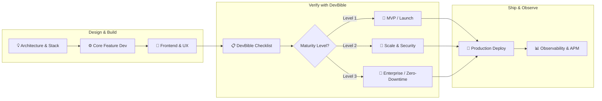

# DevBible 📚✨

> The ultimate open-source development reference built by and for vibecoders and modern builders. Ship robust, production-ready applications without reinventing the wheel.

[](https://opensource.org/licenses/MIT)
[](CONTRIBUTING.md)
[](checklist/README.md)
[](checklist/MATURITY-LEVELS.md)
[](CHANGELOG.md)

---

## 🌟 What is DevBible?

**DevBible** is an opinionated, practical development reference created for modern full-stack developers, indie hackers, and vibecoders. In the era of rapid AI-assisted development, speed is easy — but shipping **reliable**, **secure**, and **scalable** software is where most builders struggle.

DevBible bridges that gap by providing:
1. **[Production-Readiness Checklist](checklist/README.md)**: 20+ comprehensive verification items covering everything from error boundaries and database migrations to rate limiting and privacy policies.
2. **[Project Review Checklist Template](checklist/PROJECT-REVIEW-CHECKLIST.md)**: A copyable markdown audit sheet to review and sign off on your projects before launch.
3. **[Production Maturity Framework](checklist/MATURITY-LEVELS.md)**: A 3-tier roadmap (MVP -> Growth -> Enterprise) with copyable readiness badges.
4. **[Skills Catalog](skills/README.md)**: Curated guides and best practices across modern Frontend, Backend, DevOps, and Database ecosystems.
5. **[Reusable Templates](templates/)**: Drop-in production configurations for logging, error handling, Docker Compose, and environment variables.
6. **[Practical Examples](examples/)**: Real-world code implementations demonstrating good vs. bad patterns.
7. **[Curated Resources](resources/)**: Battle-tested tools, libraries, books, and courses.

---

## ⚡ Top Favorite AI Skills & Power Tools

A hand-picked selection of essential skills and utilities for 10x vibecoders using **Claude Code**, **Codex**, and **Gemini / Antigravity**.

```text
┌─────────────────────────────────────────────────────────────────────────────┐
│ 🧠 AI Coding Power Stack                                                    │
├─────────────────┬───────────────────┬───────────────────────────────────────┤
│ Tool / Skill    │ Primary Purpose   │ Target Agents                         │
├─────────────────┼───────────────────┼───────────────────────────────────────┤
│ 1. OmniRoute    │ AI Model Gateway  │ Claude Code · Codex · Gemini          │
│ 2. Claude Code  │ Terminal Coding   │ Claude Code · Codex · Gemini          │
│ 3. Claude-Mem   │ Long-Term Memory  │ Claude Code · Codex · Gemini          │
│ 4. Grill-Me     │ Spec & Plan Align │ Claude Code · Codex · Gemini          │
│ 5. Headroom     │ Token Compression │ Claude Code · Codex · Gemini          │
└─────────────────┴───────────────────┴───────────────────────────────────────┘
```

---

### 1. 🌐 [OmniRoute](https://github.com/diegosouzapw/OmniRoute)
> **Universal local AI gateway & model routing proxy.** Connects your coding assistants to 100+ LLMs with automatic fallbacks, rate limit aggregation across free provider tiers, and automated token compression.

- **Claude Code**:
  ```bash
  # Start local OmniRoute gateway
  npx omniroute start
  # Point Claude Code to OmniRoute local endpoint
  export ANTHROPIC_BASE_URL="http://localhost:20128/v1"
  ```
- **Codex**:
  ```bash
  # Set OpenAI compatible base URL in your environment or ~/.codex/config.json
  export OPENAI_BASE_URL="http://localhost:20128/v1"
  ```
- **Gemini / Antigravity**:
  ```bash
  # Configure custom endpoint in Gemini / Antigravity settings or skill proxy
  export GEMINI_API_BASE="http://localhost:20128/v1"
  ```
- **🔗 GitHub**: [github.com/diegosouzapw/OmniRoute](https://github.com/diegosouzapw/OmniRoute)

---

### 2. 🤖 [Claude Code Setup](https://github.com/anthropics/claude-code)
> **Agentic terminal coding environment.** Operates directly inside your repository terminal to understand architecture, run tests, fix bugs, and automate Git workflows with deep MCP integration.

- **Claude Code**:
  ```bash
  npm install -g @anthropic-ai/claude-code
  claude
  # Add CLAUDE.md context to your repo root
  ```
- **Codex**:
  ```bash
  # Configure Codex CLI to emulate Claude Code workspace indexing conventions
  npx @anthropic-ai/claude-code --print-config >> ~/.codex/config.json
  ```
- **Gemini / Antigravity**:
  ```bash
  # Use Antigravity / Gemini terminal agents with CLAUDE.md & AGENTS.md conventions
  agy --mode agent
  ```
- **🔗 GitHub**: [github.com/anthropics/claude-code](https://github.com/anthropics/claude-code)

---

### 3. 🧠 [Claude-Mem](https://github.com/thedotmack/claude-mem)
> **Persistent episodic memory layer.** Automatically records session decisions, architecture insights, and user preferences into a local SQLite FTS5 database, injecting relevant historical memory into future agent sessions.

- **Claude Code**:
  ```bash
  # Install via npx
  npx claude-mem install
  # Or via plugin marketplace
  /plugin marketplace add thedotmack/claude-mem
  /plugin install claude-mem
  ```
- **Codex**:
  ```bash
  # Hook memory sync into Codex workspace
  npx claude-mem --agent codex
  ```
- **Gemini / Antigravity**:
  ```bash
  # Register claude-mem MCP server in Gemini / Antigravity config (~/.gemini/antigravity/mcp_config.json)
  npx claude-mem install --gemini
  ```
- **🔗 GitHub**: [github.com/thedotmack/claude-mem](https://github.com/thedotmack/claude-mem)

---

### 4. 🎯 [Grill-Me](https://github.com/mattpocock/skills)
> **Interactive design & scope interrogator by Matt Pocock.** Before generating any code, this skill interrogates you with targeted questions across the "design tree" (architecture, schemas, edge cases) to prevent misunderstood requirements.

- **Claude Code**:
  ```bash
  npx skills add https://github.com/mattpocock/skills --skill grill-me
  # Then invoke in chat:
  /grill-me
  ```
- **Codex**:
  ```bash
  # Copy grill-me prompt instructions into .codex/rules or .codex/skills/grill-me.md
  curl -s https://raw.githubusercontent.com/mattpocock/skills/main/skills/grill-me/SKILL.md -o .codex/skills/grill-me.md
  ```
- **Gemini / Antigravity**:
  ```bash
  # Place into Antigravity builtin or global skills directory
  mkdir -p ~/.gemini/antigravity/skills/grill-me
  curl -s https://raw.githubusercontent.com/mattpocock/skills/main/skills/grill-me/SKILL.md -o ~/.gemini/antigravity/skills/grill-me/SKILL.md
  # Then trigger in chat with /grill-me
  ```
- **🔗 GitHub**: [github.com/mattpocock/skills](https://github.com/mattpocock/skills)

---

### 5. ⚡ [Headroom](https://github.com/headroomlabs-ai/headroom)
> **Real-time token & context compression layer.** Slashes token consumption by 60–95% on JSON payloads and 15–20% on codebase reads using AST-aware compression with lossless, reversible caching (CCR).

- **Claude Code**:
  ```bash
  # Wrap Claude Code directly
  headroom wrap claude
  # Or run Headroom proxy
  headroom proxy --port 8787
  export ANTHROPIC_BASE_URL="http://localhost:8787"
  ```
- **Codex**:
  ```bash
  # Wrap Codex CLI or proxy OpenAI requests
  headroom wrap codex
  export OPENAI_BASE_URL="http://localhost:8787/v1"
  ```
- **Gemini / Antigravity**:
  ```bash
  # Install Headroom MCP server for lossless retrieval
  headroom mcp install
  # Or wrap Gemini CLI
  headroom wrap gemini
  ```
- **🔗 GitHub**: [github.com/headroomlabs-ai/headroom](https://github.com/headroomlabs-ai/headroom)

---

## 🏆 Community Favorites & The Harsh Truth About AI Skills

> 💡 **The Core Realization**: Most leaderboard skills *do not* drastically improve model outputs compared to writing a clear, unambiguous prompt. The real superpower lies in **automating repetitive workflows** and creating **internal, repository-specific skills** (e.g. *"how to build a new API endpoint in this exact codebase"*), rather than hoarding generic public skills that pollute agent context.

For full architectural details and guides on building custom repo skills, see the **[Community Skills Guide](skills/community-skills-guide.md)**.

### 📊 Community Skills Summary Table

| Skill / Command | Purpose & Workflow | Official / Ecosystem Source |
| :--- | :--- | :--- |
| **`grill-me`** | Interrogates the dev via a structured design tree before writing code | [mattpocock/skills](https://github.com/mattpocock/skills) |
| **`prototype`** | Builds throwaway sandbox prototypes to validate UI/logic fast | [mattpocock/skills](https://github.com/mattpocock/skills) |
| **`frontend-design`** | 3-step design process (Brainstorm ➔ Review ➔ Implementation) | [anthropics/claude-code](https://github.com/anthropics/claude-code) |
| **`skill-creator`** | Meta-prompt framework for building bespoke repository skills | [anthropics/skills](https://github.com/anthropics/skills) |
| **`systematic-debugging`** | 4-phase root-cause analysis (Investigate ➔ Pattern ➔ Test ➔ Patch) | Community Standard |
| **`tdd`** | Enforces Red ➔ Green ➔ Refactor test-driven cycles | Community Standard |
| **`triage`** | Converts chaotic bug/feature brainstorms into crisp agent briefs | Community Standard |
| **`handoff`** | Serializes and compacts session context to pass to fresh subagents | Community Standard |
| **`improve-architecture`** | Evaluates modularity, coupling, and clean architecture heuristics | Community Standard |
| **`review`** | Native pre-commit & PR git diff reviewer (built-in) | Pre-installed in Claude Code |
| **`find-skills`** | Marketplace search *(⚠️ Caution: risk of context bloat)* | Community Ecosystem |

---

## 🔄 The Production Delivery Lifecycle



---

## 📁 Repository Structure

```text
devbible/
│
├── README.md                    # Overview and guide (You are here)
├── CONTRIBUTING.md              # How to contribute to DevBible
├── CHANGELOG.md                 # Semantic version history
├── LICENSE                      # MIT License
│
├── .github/                     # GitHub Community & Automation
│   ├── ISSUE_TEMPLATE/          # Issue templates (Propose items, report gaps)
│   ├── PULL_REQUEST_TEMPLATE.md # Standard PR review checklist
│   └── workflows/               # CI markdown linting & link checker
│
├── skills/                      # Curated Skills & Stack Reference
│   ├── README.md                # Skills index & stack overview
│   ├── frontend/                # React, Vue, CSS Frameworks
│   ├── backend/                 # Node.js, Python, Go
│   ├── devops/                  # Docker, CI/CD pipelines
│   └── database/                # PostgreSQL, MongoDB
│
├── checklist/                   # 20-Item Production-Readiness Checklist
│   ├── README.md                # Master checklist index & progress tracker
│   ├── MATURITY-LEVELS.md       # 3-Tier maturity framework & badges
│   ├── 01-error-handling.md     # Global exception handling & API error standards
│   ├── 02-logging.md            # Structured JSON logs & correlation IDs
│   ├── 03-database-backup.md    # Automated backups & restore testing
│   ├── 04-staging-environment.md# Isolated staging & preview deploys
│   ├── 05-monitoring.md         # APM, health checks & error alerting
│   ├── 06-analytics.md          # Privacy-friendly product & user analytics
│   ├── 07-rate-limiting.md      # API rate limiting & DDoS protection
│   ├── 08-access-control.md     # Role-based access control (RBAC/ABAC)
│   ├── 09-password-reset.md     # Secure token generation & credential recovery
│   ├── 10-loading-states.md     # Skeletons, spinners & layout stability
│   ├── 11-error-states.md       # Error boundaries & fallback UX
│   ├── 12-responsiveness.md     # Mobile-first design & cross-device layouts
│   ├── 13-backend-validation.md # Schema validation & input sanitization
│   ├── 14-database-migrations.md# Zero-downtime migrations & rollbacks
│   ├── 15-rollback-strategy.md  # Automated deployment rollback triggers
│   ├── 16-testing.md            # Automated testing strategy (Unit, Integration, E2E)
│   ├── 17-privacy-policy.md     # GDPR/CCPA compliance & cookie consent
│   ├── 18-terms-of-service.md   # User terms & legal liability protection
│   ├── 19-image-compression.md  # Modern formats (WebP/AVIF) & responsive delivery
│   └── 20-404-error-page.md     # Actionable 404 page & navigation recovery
│
├── templates/                   # Drop-in Production Templates
│   ├── error-handler/           # Express & FastAPI error handlers
│   ├── logging-config/          # Pino & Structlog JSON loggers
│   └── docker-compose/          # Multi-service production compose stack
│
├── resources/                   # Curated Developer Resources
│   ├── recommended-tools.md     # Vetted developer tools & services
│   └── books-and-courses.md     # Top-tier engineering books & learning paths
│
└── examples/                    # End-to-End Implementation Examples
    ├── error-handling/          # Standard response wrappers & custom errors
    └── logging-configuration/   # Request-scoped logger with correlation IDs
```

---

## 🔍 Searchable Topic & Keyword Index

Looking for a specific topic? Jump directly to the relevant guide:

| Tag / Keyword | Related Files |
| :--- | :--- |
| `#security` `#auth` | [08-access-control.md](checklist/08-access-control.md), [09-password-reset.md](checklist/09-password-reset.md), [07-rate-limiting.md](checklist/07-rate-limiting.md) |
| `#observability` `#logging` | [02-logging.md](checklist/02-logging.md), [05-monitoring.md](checklist/05-monitoring.md), [pino-logger.ts](templates/logging-config/pino-logger.ts) |
| `#frontend` `#ux` `#performance` | [10-loading-states.md](checklist/10-loading-states.md), [11-error-states.md](checklist/11-error-states.md), [12-responsiveness.md](checklist/12-responsiveness.md), [19-image-compression.md](checklist/19-image-compression.md), [20-404-error-page.md](checklist/20-404-error-page.md) |
| `#database` `#migrations` | [03-database-backup.md](checklist/03-database-backup.md), [14-database-migrations.md](checklist/14-database-migrations.md), [postgresql.md](skills/database/postgresql.md), [mongodb.md](skills/database/mongodb.md) |
| `#devops` `#deployment` | [04-staging-environment.md](checklist/04-staging-environment.md), [15-rollback-strategy.md](checklist/15-rollback-strategy.md), [docker.md](skills/devops/docker.md), [ci-cd.md](skills/devops/ci-cd.md) |
| `#compliance` `#legal` | [17-privacy-policy.md](checklist/17-privacy-policy.md), [18-terms-of-service.md](checklist/18-terms-of-service.md) |

---

## 🛡️ Production Readiness Badges

Showcase your project's production readiness in your repository's README:

```markdown
<!-- Level 1: MVP Ready -->
[](https://github.com/devcaiada/devbible/blob/main/checklist/MATURITY-LEVELS.md)

<!-- Level 2: Scale Ready -->
[](https://github.com/devcaiada/devbible/blob/main/checklist/MATURITY-LEVELS.md)

<!-- Level 3: Enterprise Ready -->
[](https://github.com/devcaiada/devbible/blob/main/checklist/MATURITY-LEVELS.md)
```

---

## 🤝 Contributing

We welcome contributions from everyone! Whether you want to propose a new checklist item, report a missing topic, or share a battle-tested template:

1. Read our [Contribution Guide](CONTRIBUTING.md).
2. Use one of our [GitHub Issue Templates](.github/ISSUE_TEMPLATE/).
3. Submit a pull request following our standard format.

---

## 📄 License

DevBible is open-source software licensed under the [MIT License](LICENSE).
